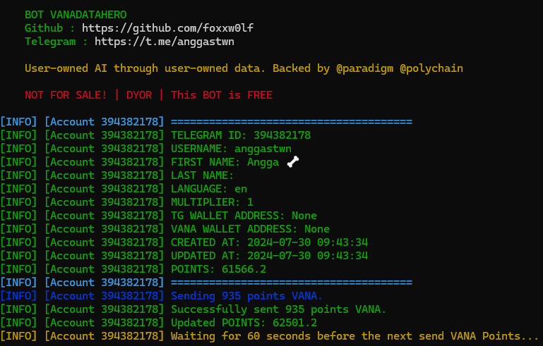

#vanadatahero
Auto Tap VanaDataHero

<center>

</center>

# Table of Contents
- [vanadatahero](#vanadatahero)
- [Table of Contents](#table-of-contents)
- [Feature](#feature)
- [Registration](#registration)
- [How to Use](#how-to-use)
  - [Windows](#windows)
- [How to Get Data](#how-to-get-data)

# Feature

- ✅ Auto Tapp
- ✅ Multi Account 
- ✅ Custom config
    "custom_points_min": 100,
    "custom_points_max": 1000,
    "check_interval": 60,
    "loop_count": 2,
    "sleep_duration": 30,
    "account_switch_delay": 10  
- ✅ Check validation query

- ⏰ Query not work long

# Registration

Start bot : [HERE](https://t.me/VanaDataHeroBot/VanaDataHero?startapp=394382178)

# How to Use

## Windows 

1. Make sure you computer was installed python and git.
   
   python site : [https://python.org](https://python.org)
   
   git site : [https://git-scm.com/](https://git-scm.com/)

2. Clone this repository
   ```shell
   git clone git clone https://github.com/foxxw0lf/vanadatabot.git
   ```

3. goto vanadatabot directory
   ```
   cd vanadatabot
   ```

4. install the require library
   ```
   pip install requests colorama

   ```

5. fill the `account.json` file with your data, how to get data you can refer to [How to Get Data](#how-to-get-data)
6. execute the main program 
   ```
   START.bat
   ```
# How to Get Data
   
   1. Active web inspecting in telegram app ex. vanadatahero
   2. Goto vanadatahero bot and open the apps
   3. Press `F12` on your keyboard to open devtool and go to `Application` then `Session Storage` after that copy `tgWebAppData`


